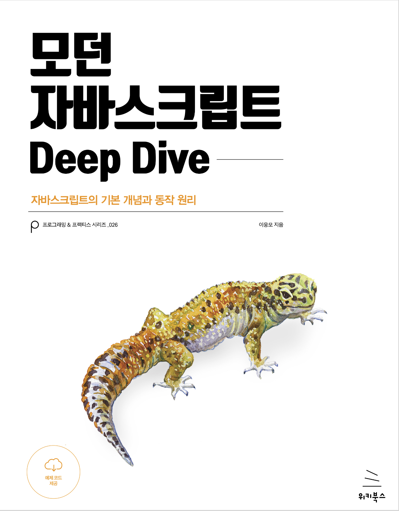

## 👩🏻‍💻 javascript-study

> 자바스크립트의 **기본 개념**과 **동작 원리**를 학습하고,
> 챕터별로 정리합니다. 

### 프로젝트 구조 📂

> **```chapter/제목/제목.md```**   
> **ex. ```chapter01/프로그래밍/프로그래밍이란?.md```**

### Books 📚

#### <span style="background-color:#FFFFF0"> 모던 자바스크립트 Deep Dive </span>

