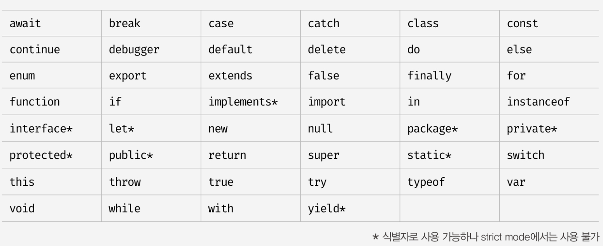

## 식별자 네이밍 규칙

### 목차

1. [식별자](#식별자)
2. [예약어](#예약어)
3. [네이밍 컨벤션](#네이밍-컨벤션)


### 식별자

> 식별자는 어떤 값을 구별해서 식별해낼 수 있는 고유한 이름을 말한다.   
> 식별자는 다음과 같은 네이밍 규칙을 준수해야 한다.   
> 1. 식별자는 특수문자를 제외한 문자, 숫자, 언더스코어(_), 달러 기호($)를 포함할 수 있다.
> 2. 단, 식별자는 특수문자를 제외한 문자, 언더스코어(_), 달러 기호($)로 시작해야한다. 숫자로 시작하는 것은 허용하지 않는다.
> 3. 예약어는 식별자로 사용할 수 없다.

### 예약어

> 예약어는 프로그래밍 언어에서 사용되고 있거나 사용될 예정인 단어를 말한다.



- 변수 이름도 식별자이므로 위 네이밍 규칙을 따라야 한다.
- 변수 이름은 변수의 존재 목적을 쉽게 이해할 수 있도록 의미를 명확히 표현해야 한다.

### 네이밍 컨벤션

> 네이밍 컨벤션은 하나 이상의 영어 단어로 구성된 식별자를 만들 때 가독성 좋게 단어를 한눈에 구분하기 위해 규정한 명명 규칙이다.   
> 네이밍 컨벤션을 잘 지키면 읽기 좋은 이름을 만들 수 있다.   
> 다음과 같은 4가지 유형의 네이밍 컨벤션이 자주 사용된다.

```javascript
// 카멜 케이스(camelCase) 
var firstName;

// 스네이크 케이스(snake_case)
var first_name;

// 파스칼 케이스(PascalCase)
var FirstName;

// 헝가리언 케이스(typeHungarianCase) 
var strFirstName; // type + identifier 
var $elem = document . getElementById('myId'); // DOM 노드 
var observable$ = fromEvent(document , 'click'); // RxJS 옵저버블
```

- 일관성을 유지한다면 어떤 네이밍 컨벤션을 써도 좋지만 자바스크립트에서는 일반적으로 변수나 함수의 이름에는 **카멜 케이스**를 사용하고,   
  생성자 함수, 클래스 이름에는 **파스칼 케이스**를 사용한다.
